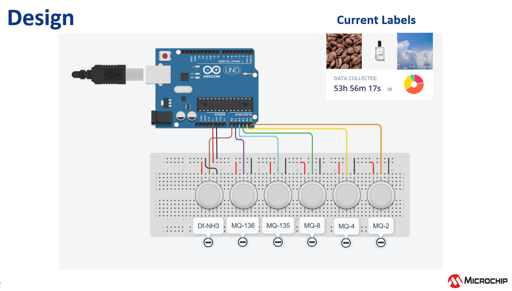
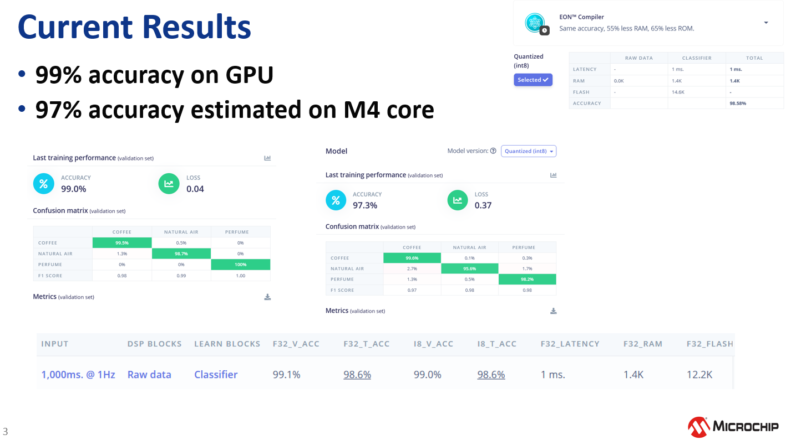
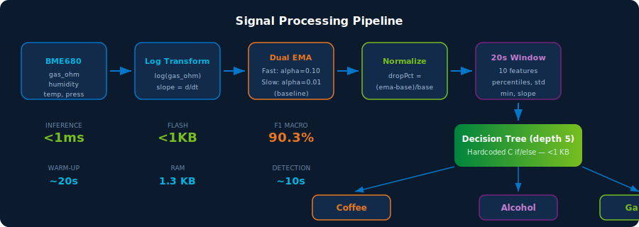
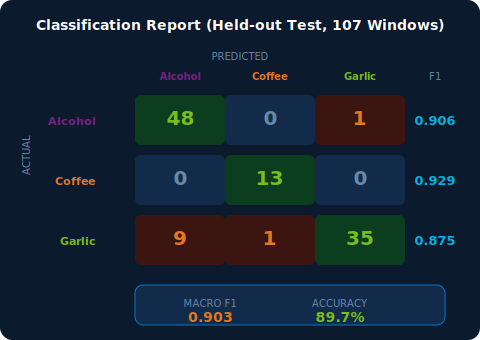

  

# E-Nose Comparison: MQ Sensor Array vs BME680

A side-by-side comparison of the two electronic nose implementations.

---

## Overview

| | Original (MQ Array) | Improved (BME680) |
|---|---|---|
| **Repository** | [MicrochipTech/E-nose](https://github.com/MicrochipTech/E-nose) | This repo |
| **Date** | December 2025 | March 2026 |
| **Scents** | Coffee, perfume, clean air | Coffee, alcohol, garlic |
| **Accuracy** | ~98% (Edge Impulse reported) | 90.3% F1 macro (held-out test) |

---

## Hardware

| Aspect | MQ Array | BME680 |
|--------|----------|--------|
| **Sensors** | 6x MQ-series gas sensors (MQ-2, MQ-3, MQ-4, MQ-5, MQ-6, MQ-135) | 1x Bosch BME680 |
| **MCU** | Adafruit Feather M4 Express | Adafruit Feather M4 Express |
| **Wires** | 12+ (power + analog for each sensor) | 4 (I2C: SDA, SCL, 3V, GND) |
| **Power draw** | High (MQ heaters ~150mA each) | Low (~12mA during measurement) |
| **Warm-up** | 24-48 hours for stable MQ readings | ~20 seconds |
| **Size** | Large (6 sensors + breakout boards) | Tiny (single breakout board) |
| **Cost** | ~$30-40 (6 sensors) | ~$10 (one BME680 module) |
| **Measurements** | Gas resistance only (6 channels) | Gas + temperature + humidity + pressure |

---

## Machine Learning

| Aspect | MQ Array | BME680 |
|--------|----------|--------|
| **Platform** | Edge Impulse (cloud) | scikit-learn (local Python) |
| **Model type** | Neural network (TFLite Micro) | Decision tree (depth 5) |
| **Runtime** | TensorFlow Lite Micro library | None (hardcoded C if/else) |
| **Model size (flash)** | ~50-100 KB (TFLite model + runtime) | < 1 KB |
| **RAM usage** | ~10-20 KB | 1.3 KB |
| **Inference time** | ~10-50 ms | < 1 ms |
| **Training** | Cloud (Edge Impulse web UI) | Local (Python script) |
| **Retraining** | Re-upload data, retrain in browser | Run script, copy C code |

---

## Signal Processing

| Aspect | MQ Array | BME680 |
|--------|----------|--------|
| **Input** | 6 raw analog readings | log(gas_ohm), humidity, EMA, slopes |
| **Normalization** | Edge Impulse preprocessing | dropPct (EMA vs slow baseline) |
| **Baseline handling** | Not addressed | Slow EMA baseline + manual `b` command |
| **Drift resilience** | Sensitive to MQ drift | Invariant (all features are relative) |
| **Window** | Fixed-size input block | 20-second rolling window (10 features) |
| **Transition handling** | Not addressed | Turbulence relabeling at slope reversal |

---

## Practical Differences

### MQ Array Strengths
- Higher reported accuracy (~98%)
- Multiple sensor types provide chemical diversity
- Well-suited for distinguishing chemically dissimilar odors
- Edge Impulse provides easy-to-use training GUI

### BME680 Strengths
- Single sensor, minimal wiring, lower cost
- Faster warm-up (seconds vs hours)
- No cloud dependency or ML runtime needed
- Baseline-drift invariant across power cycles
- Classifies during transitions (turbulence relabeling)
- Tiny footprint — leaves room for other application logic
- Humidity and temperature as additional discriminating features
- Fully reproducible training pipeline (Python scripts in repo)

---

## When to Use Which

| Scenario | Recommended |
|----------|-------------|
| Maximum classification accuracy | MQ Array |
| Quick demo or proof of concept | BME680 |
| Battery-powered / low-power | BME680 |
| Many chemically similar scents (5+) | MQ Array |
| Resource-constrained MCU | BME680 |
| No internet for training | BME680 |
| Production with known stable environment | MQ Array |
| Variable environment (humidity, temp shifts) | BME680 |

---

## Architecture Diagram

### Original (MQ Array)

  

### Original Results (Edge Impulse)

  

### Improved (BME680)

  

### Improved Results

  

---

## Links

- [Original E-nose repo](https://github.com/MicrochipTech/E-nose)
- [BME680 Datasheet](https://www.bosch-sensortec.com/products/environmental-sensors/gas-sensors/bme680/)
- [Adafruit Feather M4 Express](https://www.adafruit.com/product/3857)
