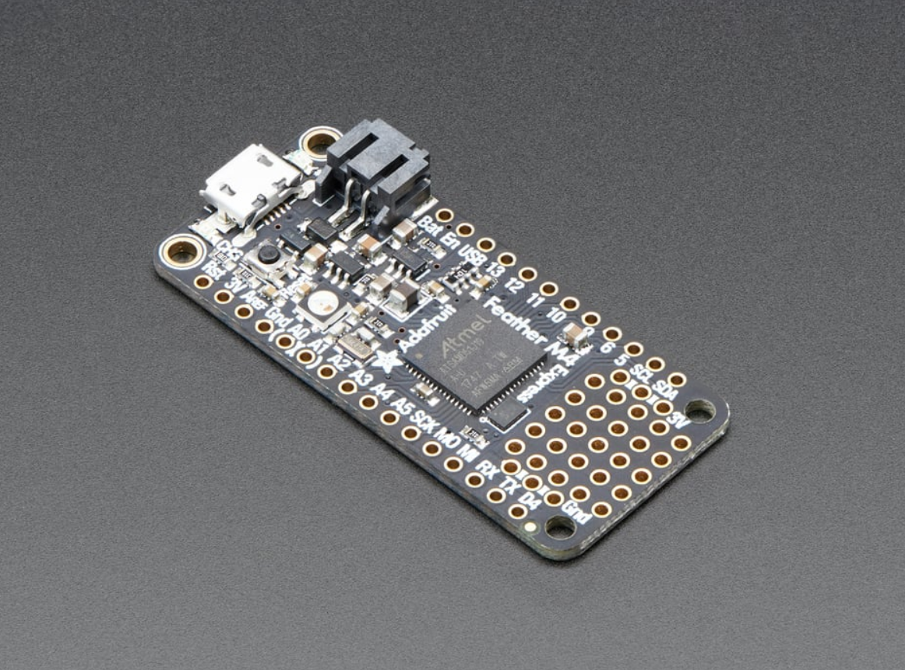

<p align="center">
  
</p>

<h1 align="center">BME680 Electronic Nose</h1>

<p align="center">
  
</p>

On-device odor classifier distinguishing **coffee, alcohol, and garlic** using a single Bosch BME680 gas sensor and a scikit-learn decision tree deployed on an Adafruit Feather M4 Express (SAMD51).

No cloud. No ML library. The entire model runs as hardcoded C `if/else` on the microcontroller.

**Result: 90.3% F1 macro. Scent transitions detected within ~10 seconds.**

> This is an improved version of the [MQ-sensor-array E-nose](https://github.com/MicrochipTech/E-nose) — see the [comparison page](https://microchiptech.github.io/E-nose-BME680/) or [COMPARISON.md](COMPARISON.md) for a detailed side-by-side breakdown.

---

## Hardware

<p align="center">
  
</p>
<p align="center">
  
</p>

| Part | Details |
|------|---------|
| MCU | Adafruit Feather M4 Express (SAMD51, 120 MHz) |
| Sensor | Bosch BME680 (gas resistance, temperature, humidity, pressure) |
| Interface | I2C (auto-scans 0x76 / 0x77) |
| LED | Built-in NeoPixel on pin 8 |

### Wiring (BME680 to Feather M4)

| Wire Color | BME680 Pin | Feather M4 Pin |
|------------|-----------|----------------|
| Red | 3Vo | 3V |
| Black | GND | GND |
| Yellow | SCK | SCL |
| Blue | SDI | SDA |

---

## How It Works

### Signal Processing Pipeline

<p align="center">
  
</p>

### Features (10 total)

| Feature | Description |
|---------|-------------|
| `hum_min` | Minimum humidity in window |
| `hum_p10` | 10th percentile humidity |
| `gasLog_p50` | Median log(gas) |
| `gasSlope_p50` | Median gas slope (rate of change) |
| `gasEma_min` | Minimum EMA value |
| `gasEma_p10` | 10th percentile EMA |
| `gasEma_p90` | 90th percentile EMA |
| `dropPct_p50` | Median drop percentage |
| `gasOhms_std` | Standard deviation of raw gas |
| `gasOhms_min` | Minimum raw gas |

### Scent Signatures

| Scent | dropPct Range | Direction |
|-------|--------------|-----------|
| Coffee | +0.30 to +1.10 | Rises above baseline |
| Alcohol | -0.85 to -0.95 | Drops sharply below baseline |
| Garlic | -0.40 rising to +0.44 | Recovers from trough, rises above |

---

## Key Innovation: Turbulence Relabeling

The original approach labeled transition periods between scent jars as "turbulence" (a separate class). This meant the model could only classify *after* the signal settled.

**The fix:** Split each turbulence segment at the slope reversal point. The first half (fading signal) keeps the previous scent's label. The second half (arriving signal) gets the next scent's label.

```
Before:  [coffee] [turbulence] [garlic]
After:   [coffee  coffee] [garlic  garlic]
                       ^
                slope reversal point
```

This improved F1 from 86.3% to 90.3% (decision tree) and means the model classifies correctly *during* scent transitions — critical for live demos.

---

## Model Performance

| Metric | Value |
|--------|-------|
| Algorithm | Decision tree, depth 5, balanced class weights |
| Flash footprint | < 1 KB (hardcoded C if/else) |
| RAM footprint | 1.3 KB (sample ring buffers) |
| Inference time | < 1 ms on 120 MHz M4 |

### Classification Report (held-out test, 107 windows)

<p align="center">
  
</p>

```
              precision    recall  f1-score   support
     alcohol      0.842     0.980     0.906        49
      coffee      0.867     1.000     0.929        13
      garlic      1.000     0.778     0.875        45
   macro avg      0.903     0.919     0.903       107
```

---

## Usage

### Demo Sequence

1. Power on and wait for `# filling` messages (~20 seconds)
2. Send `b` to lock baseline to current stable level
3. Place coffee jar lid over sensor - LED turns brown, serial shows `CLASS=coffee`
4. Swap to alcohol - within ~10s, LED turns purple, `CLASS=alcohol`
5. Swap to garlic - within ~10s, LED turns gold, `CLASS=garlic`

### Serial Commands

| Command | Effect |
|---------|--------|
| `b` | Snap baseline to current gasEma (send after ~20s warm-up) |
| `h` | Print help |

**Important:** Set Serial Monitor to **No line ending** (not "Both NL & CR") or commands won't parse correctly.

### LED Colors

| State | Color | RGB |
|-------|-------|-----|
| Filling window | Blue pulse | (0, 0, pulse) |
| Coffee | Brown | (80, 30, 5) |
| Alcohol | Purple | (120, 0, 180) |
| Garlic | Gold | (200, 120, 0) |

---

## Retraining

To retrain with new data:

```bash
# 1. Relabel turbulence segments
python training/relabel_turbulence.py --csv your_raw_log.csv

# 2. Train new decision tree
python training/train_bme680_v3.py --csv your_raw_log_relabeled.csv

# 3. Copy the printed C if/else code into the firmware's predict_class() function
```

### Requirements

```
numpy
pandas
scikit-learn
```

---

## Repository Structure

```
E-nose-BME680/
├── README.md
├── COMPARISON.md
├── comparison.html              # Standalone comparison page
├── docs/index.html              # GitHub Pages comparison site
├── firmware/
│   └── BME680_Classifier_FINAL_V2/
│       └── BME680_Classifier_FINAL_V2.ino
├── training/
│   ├── train_bme680_v3.py       # Decision tree trainer
│   └── relabel_turbulence.py    # Turbulence segment relabeler
└── data/
    └── wAlcohol_bme680_log_relabeled.csv
```

---

## Known Issues

| Issue | Cause | Fix |
|-------|-------|-----|
| Sensor not detected | LCD on same I2C bus | Unplug LCD |
| `b` command ignored | Wrong line ending in Serial Monitor | Set to "No line ending" |
| Stuck on previous scent | 20s window retains old samples | Wait 20s or power cycle |
| Humidity gate misfires | Room humidity above threshold | Adjust threshold or rely on tree alone |
| BME680 baseline shifts | Normal sensor behavior across power cycles | Send `b` after warm-up; dropPct normalizes this |

---

## License

MIT

---

## Contact

gokce.yavuz@microchip.com
